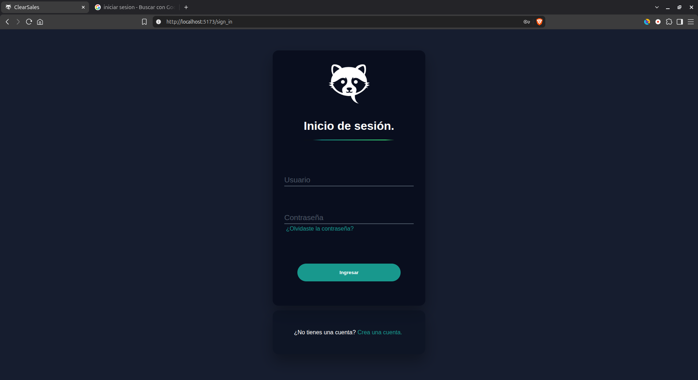
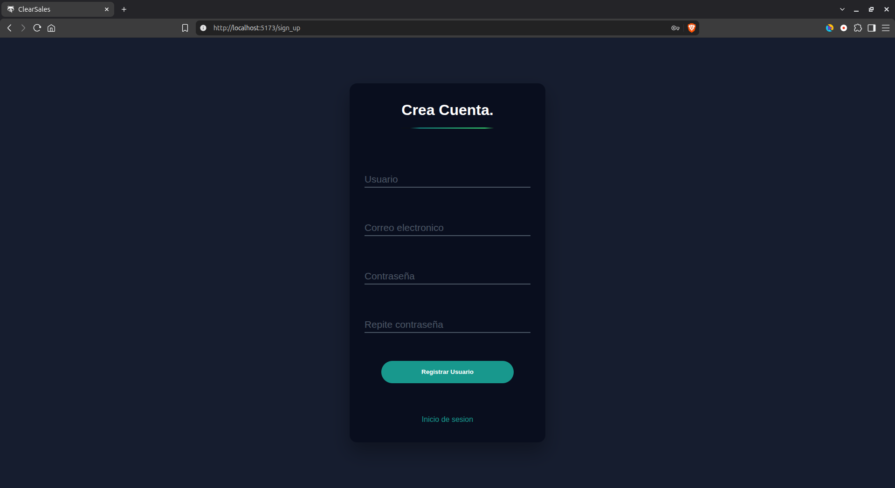
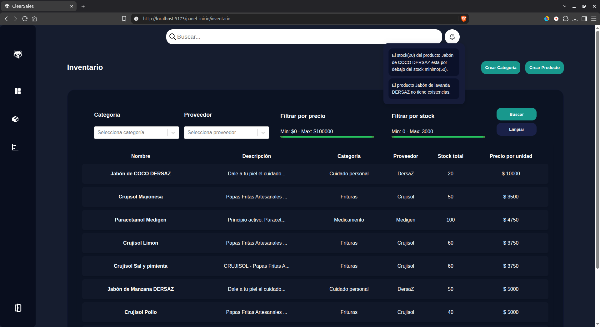
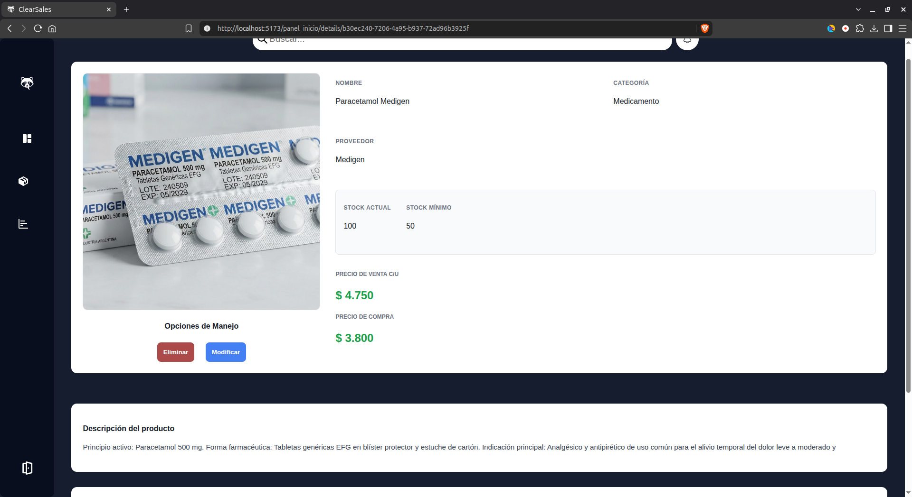
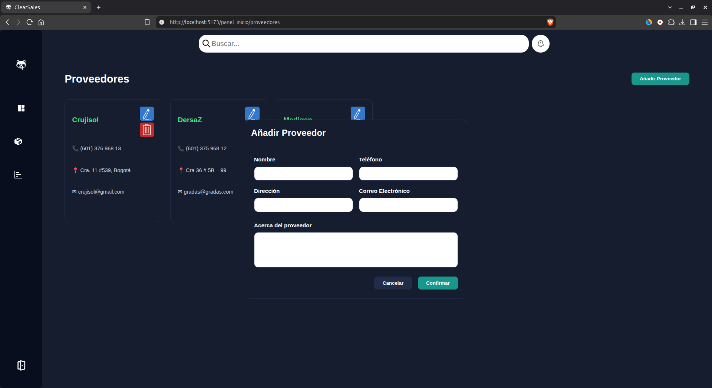

# 📦 Sistema de Gestión de Inventarios — SGI

Aplicación web desarrollada como **Producto Mínimo Viable (PMV)** de un Sistema de Gestión de Inventarios.

El sistema permite administrar y consultar información relacionada con los productos de un inventario mediante una aplicación web.

---

## 📸 Vista previa

### 🔐 Inicio de sesión



### 📝 Registro



### 🏠 Página principal



### 👁️ Información del producto



### 🏢 Proveedores



---

## 📌 Sobre el proyecto

El **SGI (Sistema de Gestión de Inventarios)** es un proyecto desarrollado como un **Producto Mínimo Viable**, cuyo propósito es ofrecer una aplicación web para organizar y consultar la información de los productos de un inventario.

El sistema cuenta con un frontend y un backend que trabajan conjuntamente para gestionar y mostrar la información almacenada.

El proyecto está compuesto principalmente por:

* **Frontend:** encargado de la interfaz y la interacción con el usuario.
* **Backend:** encargado de la lógica del sistema y el procesamiento de la información.
* **Base de datos:** utilizada para almacenar la información necesaria para el funcionamiento de la aplicación.

---

## ✨ Funcionalidades

* 🔐 Inicio de sesión.
* 📝 Registro de usuarios.
* 👤 Gestión de usuarios.
* 📦 Gestión de productos.
* 🏢 Gestión de proveedores.
* ➕ Creación de productos.
* ✏️ Edición de productos.
* 🗑️ Eliminación de productos.
* 🔎 Consulta de productos.
* 👁️ Visualización de información de los productos.
* 🗄️ Almacenamiento de información en base de datos.

---

## 🛠️ Tecnologías utilizadas

### Frontend

* ⚛️ **React**
* JavaScript
* HTML
* CSS

### Backend

* 🐍 **Python**
* 🌐 **Django**

### Base de datos

* 🗄️ **MariaDB / MySQL**

### Herramientas

* Git
* GitHub

---

## 🧩 Arquitectura

La aplicación utiliza una arquitectura dividida en frontend, backend y base de datos.

```text
              ┌───────────────────┐
              │      Usuario      │
              └─────────┬─────────┘
                        │
                        ▼
              ┌───────────────────┐
              │     Frontend      │
              │      React        │
              └─────────┬─────────┘
                        │
                        ▼
              ┌───────────────────┐
              │      Backend      │
              │  Python / Django  │
              └─────────┬─────────┘
                        │
                        ▼
              ┌───────────────────┐
              │    Base de datos  │
              │   MariaDB/MySQL   │
              └───────────────────┘
```

---

## 📁 Estructura del proyecto

```text
PMV/
│
├── backend/
│
├── frontend/
│
├── database_sgi.sql
│
├── .gitignore
│
└── README.md
```

### `backend/`

Contiene el código del servidor y la lógica necesaria para el funcionamiento del sistema.

### `frontend/`

Contiene la interfaz desarrollada con React y los componentes utilizados para la interacción con el usuario.

### `database_sgi.sql`

Archivo SQL relacionado con la base de datos utilizada por el proyecto.

---

## 📦 Gestión de productos

El sistema permite administrar los productos registrados en el inventario desde la aplicación.

Las principales operaciones disponibles son:

* Crear productos.
* Consultar productos.
* Modificar productos.
* Eliminar productos.
* Visualizar información de productos.

La información gestionada por el sistema se almacena en la base de datos y es utilizada por el backend y el frontend.

---

## 🏢 Gestión de proveedores

El sistema permite gestionar la información relacionada con los proveedores de los productos.

Esta funcionalidad facilita mantener organizados los datos de los proveedores dentro del sistema de inventario.

---

## 🔐 Autenticación

El sistema cuenta con funcionalidades de **registro e inicio de sesión**, permitiendo a los usuarios crear una cuenta y acceder posteriormente a la aplicación mediante sus credenciales.

---

## 🗄️ Base de datos

El proyecto utiliza una base de datos para almacenar la información necesaria para el funcionamiento del sistema.

El repositorio incluye el archivo:

```text
database_sgi.sql
```

Este archivo contiene los elementos necesarios para trabajar con la base de datos del proyecto.

> La administración directa de la base de datos se realiza mediante las herramientas correspondientes y no mediante una interfaz propia dentro de la aplicación.

---

## 🎯 Objetivo del proyecto

El objetivo del proyecto es desarrollar un **Producto Mínimo Viable de un Sistema de Gestión de Inventarios**, aplicando conocimientos de desarrollo web y gestión de datos.

Durante el desarrollo se trabajaron conceptos como:

* Desarrollo de interfaces con React.
* Desarrollo backend con Python y Django.
* Gestión de bases de datos.
* Operaciones CRUD.
* Autenticación de usuarios.
* Gestión de productos y proveedores.
* Comunicación entre frontend y backend.
* Organización de un proyecto Full Stack.
* Control de versiones con Git y GitHub.
